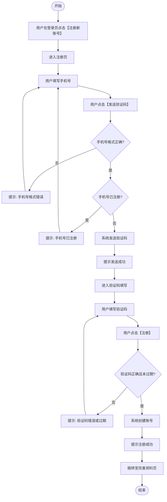

# 手机号验证码注册 需求文档

## **版本记录**

| 版本 | 日期 | 作者 | 变更说明 | 审批人 |
|:---:|:---:|:---:|:---|:---:|
| V1.0 | 2024-11-01 | 小明 | 初稿创建 | — |
| V2.0 | 2024-12-15 | 小明 | 补充技术方案细节 | 李四 |
| V3.0 | 2025-01-22 | 小明 | 修订评审反馈意见 | 评审中 |

---

## 核心摘要

> **【必讲】** 即使听众后面走神了，也已经拿到了最关键的信息。

- **为谁做：** 运营团队提出，支持公司新用户翻倍目标
- **做什么：** 新用户自助手机号注册，替代运营手动开通
- **核心方案：** 手机号 + 短信验证码，注册成功后跳转完善资料页
- **需要谁配合：** 前端（注册页）、后端（账号系统 + 短信服务）、测试
- **何时交付：** 12 月底前完成开发，1 月上旬上线

---

## 一、简要背景

> **【必讲】** 30 秒内讲完。

| 问题 | 回答 |
|------|------|
| 为谁做 | 运营团队提出，支持公司"新用户翻倍"年度目标 |
| 做完有什么价值 | 注册周期从 3 天缩短到 3 分钟，释放运营人力，为裂变营销提供底层能力 |
| 不做会怎样 | 推广期运营手动开通成为卡点，无法承接大规模新用户涌入 |

### 目标指标

| 指标 | 当前值 | 目标值 | 统计口径 | 验收/复盘方式 |
|------|--------|--------|----------|---------------|
| 注册开通耗时 | 约 3 天 | 3 分钟内 | 从用户进入注册页到完成账号创建 | 上线后抽样核对注册记录 |

---

## 二、名词解释

> **【read only】** 无必要术语时写"无"。

无

---

## 三、页面/组件说明（具体流程在前）

> **【必讲】** 按用户操作顺序排列，读者从上往下读一遍就能理解完整流程。

### 3.1 产品机制骨架

> 🔶 **高亮结论：**
> - 这个需求要改变的核心行为/结果是：从"运营手动开通账号"到"用户自助完成注册"
> - 依赖的核心状态是：手机号是否已注册、验证码是否有效
> - 触发条件是：用户在登录页点击【注册新账号】，完成标准是：账号创建成功并跳转完善资料页

| 维度 | 结论 | 待确认 |
|------|------|--------|
| 需求结果 | 从"运营手动开通"到"用户自助注册"，注册周期 3天→3分钟 | |
| 用户场景 | 新用户刚完成推广渠道注册入口，想快速开始使用产品 | |
| 核心状态 | 手机号是否已注册、验证码是否已发送/过期、账号是否创建成功 | |
| 触发规则 | 用户在登录页点击【注册新账号】 | |
| 完成标准 | 完成：账号创建成功并跳转完善资料页；失败：验证码错误/过期/手机号已注册；跳过：无 | |
| 异常兜底 | 手机号已注册→引导登录；短信发送失败→允许重试；验证码过期→重新发送 | |
| 未来扩展 | 未来可能支持邮箱注册、第三方登录；本期只做手机号验证码 | |

### 3.2 页面/组件明细

| 页面/组件 | 原型图 | 维度 | 详细说明 |
|---------|--------|------|---------|
| **注册页** | P01 | 🔶 **结论** | **用户填写手机号 → 收到验证码 → 填写验证码 → 注册成功 → 跳转完善资料页** |
| | | 触发条件 | 用户在登录页点击【注册新账号】时触发 |
| | | 核心流程 | 校验手机号 → 未注册：发送验证码 → 用户填写验证码 → 点击注册 → 创建账号 → 跳转完善资料页 |
| | | 异常 | 手机号格式错误：Toast"请填写正确的手机号"；手机号已注册：Toast"该手机号已注册，请直接登录"；验证码错误/过期：Toast"验证码错误或已过期"；短信发送失败：Toast"发送失败，请稍后重试" |
| | | 系统逻辑 | 【首次进入】注册页：自动聚焦手机号输入框；【非首次】：保留上次输入的手机号 |
| | | 信息架构 | 页面包含：手机号输入框、区号选择器（默认+86）、【发送验证码】按钮、验证码输入框、【注册】按钮 |
| | | 字段 | 手机号★：文本框，placeholder"请输入手机号"，11位纯数字，首位为1，校验失败提示"请填写正确的手机号"；验证码★：文本框，placeholder"请输入验证码"，与已发送验证码匹配且未过期，校验失败提示"验证码错误或已过期" |
| | | 交互 | 【发送验证码】：点击后置灰60秒，显示倒计时，60秒内不可重复点击；【注册】：校验未通过时置灰不可点击；注册成功：Toast"注册成功"，2秒后自动消失；页面加载中：全屏Loading |
| | | 文案 | Toast"请填写正确的手机号"；Toast"该手机号已注册，请直接登录"；Toast"验证码已发送"；Toast"发送失败，请稍后重试"；Toast"验证码错误或已过期"；Toast"注册成功" |
| | | 边界/异常 | 同一手机号60秒内重复点击【发送验证码】：前端置灰，后端3秒内视为同一次请求；网络超时：Toast"网络异常，请重试" |
| | | 权限/角色 | 无权限差异，所有用户看到相同内容 |

---

## 四、全局流程总结（整体总结在后）

> **【必讲】** 读完第三章后，用本章做全局串联。

> 🔶 **高亮结论：**
> - 完整流程概述：用户在登录页点击注册 → 填写手机号 → 收到验证码 → 填写验证码 → 注册成功 → 跳转完善资料页
> - 关键数据依赖：手机号是否已注册以账号系统结果为准；获取失败时 Toast 提示"加载失败，请刷新重试"
> - 最大风险点：第三方短信服务不可用导致无法发送验证码

**数据依赖：** 手机号是否已注册以账号系统结果为准；获取失败时 Toast 提示"加载失败，请刷新重试"

**全局规则：**
- 弹窗关闭方式统一为点击外部区域或右上角【X】

**外部依赖与风险：**

| 依赖/风险 | 影响范围 | 用户可感知表现 | 产品处理/降级 | 验收口径 | 待确认项 |
|-----------|----------|----------------|----------------|----------|----------|
| 第三方短信服务不可用 | 验证码发送 | 用户收不到验证码或看到发送失败 | 展示失败提示，允许用户重试 | 失败时不进入成功倒计时状态 | 是否需要备用通道 |

> **【read only】** 以下为补充细节，会后查阅。

**人员依赖：**

| 角色 | 姓名/团队 | 职责范围 | 当前状态 |
|------|----------|---------|---------|
| 产品经理 | 小明 | 需求文档、评审协调 | 进行中 |
| 前端 | 小李 | 注册页面开发 | 待排期 |
| 后端 | 小张 | 账号系统、短信接口 | 待排期 |
| 测试 | 待定 | 功能测试、异常测试 | 待排期 |

**详细流程：**

---

## 五、验收标准（评审通过后单独写，Phase 5）

> 等和MT确认流程后再写。

---

## 六、非功能约束（模型判断是否需要）

> **【read only】** 本需求无明显非功能约束触发，省略本章节。

---

## 七、责任分工与交付时间

> **【必讲】** 结尾口头明确。

| 角色 | 负责人 | 职责范围 | 交付物 | 交付时间 |
|------|--------|---------|--------|----------|
| 产品 | 小明 | PRD、需求跟进 | PRD 终稿 | 11月中旬 |
| 设计 | 待定 | UI/UX 设计 | 设计稿 | 11月下旬 |
| 前端 | 小李 | 注册页面开发 | 前端代码 | 12月中旬 |
| 后端 | 小张 | 账号系统、短信接口 | 后端代码 | 12月中旬 |
| 测试 | 待定 | 功能测试、异常测试 | 测试报告 | 12月下旬 |

---

## 八、参考/对标

> **【read only】** 以下为补充细节，会后查阅。

| 参考来源 | 用途 | 位置 |
|---------|------|------|
| 竞品A注册流程 | 对标注册耗时 | 1.2 竞品对比 |
