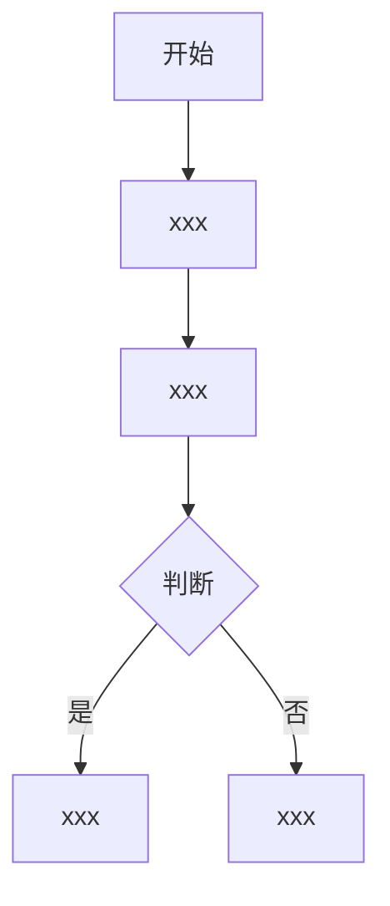

# {{功能名称}} 需求文档

## 目录

- 版本记录
- 核心摘要
- 一、简要背景
- 二、名词解释
- 三、页面/组件说明（具体流程在前）
- 四、全局流程总结（整体总结在后）
- 五、产品机制设计（可开发规则）
- 六、待确认项
- 七、验收标准（评审通过后单独写，Phase 5）
- 八、非功能约束（模型判断是否需要）
- 九、责任分工与交付时间
- 十、评审讲解提纲
- 十一、参考/对标

## **版本记录**

| 版本 | 日期 | 作者 | 变更说明 | 审批人 |
|:---:|:---:|:---:|:---:|:---:|
| V1.0 | {{YYYY-MM-DD}} | {{作者}} | 初稿创建 | — |

---

## 核心摘要

> **【必讲】** 即使听众后面走神了，也已经拿到了最关键的信息。

- **为谁做：** {{哪个老板/哪个业务方提出的}}
- **做什么：** {{简要概括要做的事}}
- **功能定位：** 让{{目标用户}}能{{完成什么事}}（不超过 25 个字）
- **核心方案：** {{简要概括核心方案}}
- **需要谁配合：** {{关键协作方}}
- **何时交付：** {{目标交付时间}}

---

## 一、简要背景

> **【必讲】** 30 秒内讲完，让听众明白"为什么要听我讲这个"。不追溯历史渊源。

| 问题 | 回答 |
|------|------|
| 为谁做 | {{哪个老板/哪个业务方提出的}} |
| 做完有什么价值 | {{对业务、对利益相关方的具体收益}} |
| 不做会怎样 | {{简要带一下紧迫性}} |

### 目标指标

> 有明确数据时正式写入；没有量化口径时标注 `【待确认：量化口径】`。轻量需求保留 1-3 条即可。

| 指标 | 当前值 | 目标值 | 统计口径 | 验收/复盘方式 |
|------|--------|--------|----------|---------------|
| {{如：注册开通耗时}} | {{如：3天}} | {{如：3分钟内}} | {{从用户提交到完成开通}} | {{上线后看埋点/后台记录}} |

---

## 二、名词解释

> **【read only】** 先参考项目目录中的 `内部术语表.md`（项目特有术语）和工作区约定位置的公司级术语表（如存在）。判断标准：新来的实习生只看本文档，不问任何人，能否理解该词在本公司、本项目里的含义和边界。无必要术语时写"无"。

| 术语 | 定义 |
|------|------|
| {{项目内特殊术语/缩写/公司内特殊叫法}} | {{使用术语表中的标准定义}} |

---

## 三、页面/组件说明（具体流程在前）

> **【必讲】** 按用户操作顺序排列，每个页面/组件占若干行（维度行），逐行描述。读者从上往下读一遍就能理解完整流程，不需要跳章节。**全文不出现技术术语（接口、API、请求、返回、前端、后端等），用业务语言描述。**

### 3.1 产品机制骨架

> **【必讲】** 写页面前先定机制。轻量需求保留"需求结果、核心状态、触发与完成、关键异常"四行即可；标准/完整需求按下表写全。每格 1-3 条，不写成长篇说明。
> **红线：** 每个功能模块、页面、核心流程都必须能简要说明存在理由；违背这句话的设计不做。

> 🔶 **高亮结论：**
> - 功能定位：让{{目标用户}}能{{完成什么事}}
> - 这个需求要改变的核心行为/结果是 {{...}}
> - 依赖的核心状态是 {{...}}
> - 触发条件是 {{...}}，完成标准是 {{...}}

| 维度 | 结论 | 待确认 |
|------|------|--------|
| 功能定位 | {{让【目标用户】能【完成什么事】，不超过 25 个字}} | |
| 需求结果 | {{这个需求要改善什么用户行为/业务结果，如：从"用户不知道如何开始"到"用户完成首次有效操作"}} | |
| 用户场景 | {{谁在什么状态下遇到这个需求，刚做完什么，最可能卡在哪里}} | |
| 核心状态 | {{用户状态、业务对象状态、系统可用状态；如：已完成前置动作、未完成引导、有/无可用业务对象}} | |
| 触发规则 | {{什么时候出现；优先绑定稳定业务状态或产品事件，不绑定临时入口/单个页面/浏览器缓存}} | |
| 完成标准 | {{什么算完成、跳过、失败、未完成；用于支撑异常和评审后验收标准}} | |
| 异常兜底 | {{最影响体验的为空、失败、中断、重复、历史用户场景}} | |
| 最难缠用户兜底 | {{关键操作 1 秒内反馈、成功提示、失败补救、内容保留、空态/到底提示、高风险确认}} | |
| 背离判断 | {{哪些新增入口/字段/流程会偏离功能定位，本期不做什么}} | |
| 未来扩展 | {{未来入口/角色/对象/版本变化后是否能承接；本期不做什么}} | |

### 写作深度

> **【read only】** 以下为写作深度参考，会后查阅。

| 需求规模 | 本章写法 |
|----------|----------|
| 轻量 | 机制骨架保留 4 行；页面明细只写关键触发、核心流程、字段/交互、关键异常 |
| 标准 | 机制骨架写全；页面明细覆盖正常流程、具体异常、文案、权限/角色 |
| 完整 | 增加状态图/流程图/泳道图；补充多入口、多角色、版本扩展边界 |

### 3.2 页面/组件明细

| 页面/组件 | 原型图 | 维度 | 详细说明 |
|---------|--------|------|---------|
| **{{页面名称}}** | {{P01}} | 🔶 **结论** | **{{直接写清这个页面做什么、核心交互、关键约束}}** |
| | | 功能定位 | **让{{目标用户}}能{{完成什么事}}。违背这句话的设计，不做。** |
| | | 触发条件 | {{什么条件下触发该页面/组件的展示或操作}} |
| | | 核心流程 | {{用户操作 → 系统响应 → 正常结果。用业务语言描述数据来源，不写技术实现}} |
| | | 评审讲解口径 | **用户看到什么：**{{页面/弹窗/列表/提示的可见内容和关键文案}}；**用户能做什么：**{{选择、点击、跳过、重试、进入等动作}}；**然后发生什么：**{{自动关闭、跳转、列表新增、进入详情、保持原页面等结果}} |
| | | 异常 | {{至少 3 个，每条回答三个问题：什么情况下发生？用户看到什么？系统怎么处理？从"操作中断、状态变化、时间推移、外部结果、多端/多入口"切入思考}} |
| | | 系统逻辑 | {{系统在什么条件下做什么判断、默认值、兜底策略。用业务语言描述}} |
| | | 信息架构 | {{页面包含哪些区域，每个区域展示什么}} |
| | | 字段 | {{用中文名，如"对象名称"：≤20字，超长截断+hover，为空不展示；校验规则；校验失败提示}} |
| | | 交互 | {{该页面的交互规则：点击、选中、禁用、Loading 等；关键操作点击后 1 秒内必须有状态变化}} |
| | | 文案 | {{位置：文案内容；...}} |
| | | 边界/异常 | {{从五个角度穷举：操作中断、状态变化、时间推移、外部结果、多端/多入口。每条写：什么情况 → 用户看到什么 → 系统怎么处理}} |
| | | 产品机制 | {{把功能描述升级为机制规则：目标结果、用户状态、系统状态、触发条件、完成定义、异常兜底、未来扩展}} |
| | | 最难缠用户兜底 | {{成功如何告知；失败原因和补救；表单/选择内容是否保留；空态/无结果/到底提示；删除/覆盖/不可改是否二次确认或可撤销}} |
| | | 背离判断 | {{本页不承接哪些贪心扩展；新增设计如何服务功能定位}} |
| | | 评审待确认 | {{现场需要拍板的问题。写成可选方案，如：A 一步弹窗完成 / B 分两步引导；并说明影响}} |
| | | 权限/角色 | {{不同角色看到的内容差异}} |
| **{{页面名称}}** | {{P02}} | 🔶 **结论** | **{{简要结论}}** |
| | | ... | {{按需添加维度行}} |

> **维度行按需增减：** 简单页面可能只有"触发条件+信息架构+文案+交互"四行；复杂页面可以有全部维度。不需要的维度不写空行。
> **异常要求：** 每条必须回答三个问题——什么情况下发生？用户看到什么？系统怎么处理？从"操作中断、状态变化、时间推移、外部结果、多端/多入口"五个角度切入。不写"网络异常→提示错误"这种只有分类没有场景的描述。
> **难缠用户要求：** 不允许静默失败、空白空态、只置灰不解释、提交失败清空内容、只有"确定"但不说明后果、删除/覆盖无确认、列表到底无提示。
> **评审讲解要求：** 现场逐页讲时只讲“用户看到什么、用户能做什么、然后发生什么”。系统判断、补充细节和风险说明留给会后查阅或答疑。

---

## 四、全局流程总结（整体总结在后）

> **【必讲】** 先读完第三章的具体页面流程后，再用本章做全局串联和总结。

> 🔶 **高亮结论：**
> - 完整流程概述：{{入口/触发事件 → 页面/组件 → 用户动作 → 结果页/结果状态}}
> - 关键数据依赖：{{本需求依赖哪些业务对象/用户状态/外部结果}}
> - 最大风险点：{{最容易导致流程中断、误判或重复结果的点}}

**数据依赖：** {{数据从哪类业务对象、用户状态或外部结果来；为空、失败、过期、无权限时分别怎么处理。用业务语言描述，不出现技术术语}}

**全局规则：**
- {{跨页面共享的规则，如：弹窗关闭方式统一为 xxx}}

**外部依赖与风险：**

| 依赖/风险 | 影响范围 | 用户可感知表现 | 产品处理/降级 | 验收口径 | 待确认项 |
|-----------|----------|----------------|----------------|----------|----------|
| {{第三方服务/上下游系统/人工审核等}} | {{哪些页面/功能受影响}} | {{用户看到什么}} | {{降级方案}} | {{怎么验收}} | {{待确认项}} |

> **【read only】** 以下为补充细节，会后查阅。

**人员依赖：**

| 角色 | 姓名/团队 | 职责范围 | 当前状态 |
|------|----------|---------|---------|
| {{产品经理}} | | | |
| {{设计}} | | | |
| {{研发}} | | | |
| {{测试}} | | | |

**详细流程：**

---

## 五、产品机制设计（可开发规则）

> **【必讲】** 这一章用于把需求从“功能描述”提升成“产品机制设计”。不要从页面、弹窗、按钮开始写；先写清这个需求要改变什么结果、谁在什么状态下需要它、系统在什么状态下触发、什么算完成、哪些异常会影响体验、未来入口变化后是否仍成立。

### 5.1 机制六问

| 思考部分 | 需要详细说明什么 | 本需求结论 |
|----------|------------------|------------|
| 功能定位 | 每个功能存在的理由；格式为“让【目标用户】能【完成什么事】”，不超过 25 个字 | {{功能定位}} |
| 结果 | 这个需求要改善什么用户行为或业务结果；不要写“做某个功能”，要写完成后用户行为发生什么变化 | {{目标结果；无量化口径时标记【待确认：量化口径】}} |
| 用户 | 谁在什么场景下遇到它；用户刚完成什么动作、最可能卡在哪里、当时有什么信息缺口 | {{用户角色 + 场景 + 心态/卡点}} |
| 状态 | 依赖什么用户状态、业务对象状态、系统状态；必须区分空态和失败态 | {{用户状态 + 业务对象状态 + 系统状态}} |
| 触发 | 什么时候出现；为什么是这个时候；触发条件是否稳定，未来入口变化后是否仍成立 | {{稳定触发事件 + 不触发条件 + 触发次数}} |
| 完成 | 什么算完成、跳过、失败、未完成；完成定义会影响是否再次触发和后续验收 | {{完成/跳过/失败/未完成定义}} |
| 兜底 | 哪些异常会影响用户体验和产品效果；重点写空数据、失败、中断、重复、历史用户、多入口变化 | {{关键异常 + 用户看到什么 + 后续处理}} |
| 不背离 | 哪些新增能力会偏离功能定位；本期明确不做什么 | {{不做范围 + 原因}} |

### 5.2 状态与分支表

| 前置状态 | 用户看到什么 | 用户能做什么 | 下一步结果 | 是否完成 | 备注 |
|----------|--------------|--------------|------------|----------|------|
| {{用户状态 + 业务对象状态 + 系统状态}} | {{页面/组件/提示}} | {{可操作项}} | {{跳转/生成结果/保持当前页/进入空态}} | {{完成/跳过/失败/未完成}} | {{待确认或特殊说明}} |

### 5.3 产品边界

| 产品必须定义 | 本需求结论 |
|--------------|------------|
| 用户点关键按钮后，1 秒内看到什么状态变化 | {{规则}} |
| 操作成功后，用户怎么知道成功了 | {{规则}} |
| 操作失败后，用户知道什么原因、怎么补救 | {{规则}} |
| 表单/选择/编辑失败或中断后，已填写内容是否保留 | {{规则}} |
| 空态、无结果、到底、不可点、无权限、过期、部分成功怎么提示 | {{规则}} |
| 删除、覆盖、提交后不可改等高风险操作是否二次确认或可撤销 | {{规则}} |
| 用户关闭、跳过、中断后，下次是否还出现 | {{规则}} |
| 前置流程失败时，用户看到什么，是否能继续 | {{规则}} |
| 空数据时用户怎么开始，是否被卡死 | {{规则}} |
| 数据加载失败时，是否会被误判成空态 | {{规则}} |
| 未来入口变化后，机制是否还成立 | {{规则}} |
| 用户完成过同一机制后，换设备、换入口、隔很久回来是否还触发 | {{规则}} |

| 不写成技术方案 | 说明 |
|----------------|------|
| 存储方式 | 不写 localStorage、cookie、数据库字段等实现细节 |
| 超时实现 | 不写接口超时几秒，除非它直接影响用户可感知等待时长 |
| 并发实现 | 不写并发请求怎么加锁，只写重复点击/重复触发的产品结果 |
| 重试实现 | 不写重试代码，只写用户是否能重试、重试后看到什么 |
| 技术细节 | 不贴代码、表结构、状态码 |

---

## 六、待确认项

> **【必讲】** 评审现场需要拍板的问题集中放这里。问题来自页面/组件明细、异常流程、已有页面改造和全局规则；每个问题必须给出可选方案和影响，不写空泛的“待确认”。

| 编号 | 所属页面/流程 | 待确认问题 | 推荐方案 | 其他可选方案 | 影响范围 | 需谁拍板 |
|------|---------------|------------|----------|--------------|----------|----------|
| Q1 | {{页面/流程名称}} | {{需要拍板的产品规则问题}} | {{推荐方案：说明理由}} | {{其他方案：说明适用场景}} | {{设计稿、交互、研发工作量、测试用例、上线节奏}} | {{产品/设计/研发/测试/业务方}} |
| Q2 | {{页面/流程名称}} | {{异常或分支处理问题}} | {{推荐方案：说明对用户和实现的影响}} | {{其他方案：说明取舍}} | {{体验、数据一致性、测试范围}} | {{产品/研发/测试}} |

---

## 七、验收标准（评审通过后单独写，Phase 5）

> 等评审通过、流程确认不再大改后再写。所有 PRD 都必须写验收标准；轻量需求 3-5 条；标准/完整需求按核心流程、异常场景、权限/数据/文案拆分。

| 编号 | 验收项 | 前置条件 | 操作/触发 | 预期结果 | 备注 |
|------|--------|----------|-----------|----------|------|
| AC-01 | {{核心流程验收}} | {{前置条件}} | {{用户或系统动作}} | {{可观察结果}} | |
| AC-02 | {{异常场景验收}} | {{前置条件}} | {{异常触发}} | {{提示、状态、跳转等}} | |

---

## 八、非功能约束（模型判断是否需要）

> **【read only】** 由模型根据需求内容判断是否需要写此章节。只在影响用户体验、验收、合规或风险时写。

| 类型 | 约束说明 | 用户/业务影响 | 验收口径 | 待确认项 |
|------|----------|---------------|----------|----------|
| | | | | |

---

## 九、责任分工与交付时间

> **【必讲】** 结尾口头明确，谁负责什么、需要谁协助、各自什么时候交付。

| 角色 | 负责人 | 职责范围 | 交付物 | 交付时间 |
|------|--------|---------|--------|----------|
| 产品 | {{姓名}} | {{PRD、需求跟进}} | {{PRD 终稿}} | {{日期}} |
| 设计 | {{姓名}} | {{UI/UX 设计}} | {{设计稿}} | {{日期}} |
| 研发 | {{姓名}} | {{技术方案、开发}} | {{技术方案}} | {{日期}} |
| 测试 | {{姓名}} | {{测试用例、执行}} | {{测试报告}} | {{日期}} |

---

## 十、评审讲解提纲

> **【必讲】** 这是现场讲解稿的骨架，不替代前面的 PRD 正文。每一页只讲三件事：用户看到什么、用户能做什么、然后发生什么。不要在这里展开系统逻辑。

| 顺序 | 讲什么 | 讲解口径 | 预计时间 | 对应章节/原型 |
|------|--------|----------|----------|---------------|
| 1 | 先讲问题 | {{简要说明用户/业务现在卡在哪里；有数据则补 1 个数据}} | 30 秒 | {{一、简要背景}} |
| 2 | 正常流程逐页走查 | {{P01 用户看到什么 → 做什么 → 看到什么；P02 ...}} | 2 分钟 | {{三、页面/组件说明}} |
| 3 | 异常流程 | {{暂无数据、创建失败、部分成功、中断等高风险场景}} | 1 分钟 | {{三、页面/组件说明 + 四、全局流程总结}} |
| 4 | 已有页面改造/P02 | {{强调这是已有页面新增入口，是否需要改版、能否独立排期}} | 30 秒 | {{三、页面/组件说明}} |
| 5 | 产品机制设计 | {{讲清结果、用户、状态、触发、完成、兜底中最需要评审确认的规则}} | 1 分钟 | {{五、产品机制设计}} |
| 6 | 待确认问题 | {{逐条抛出需要拍板的问题和推荐方案}} | 剩余时间 | {{六、待确认项}} |

---

## 十一、参考/对标

> **【read only】** 以下为补充细节，会后查阅。

| 参考来源 | 用途 | 位置 |
|---------|------|------|
| | | |
